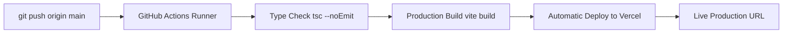

# Co-Labour (Sahaay) — Sovereign Cooperative Gig Services Platform

> A democratic, cooperative-first alternative to aggregator gig-platforms. Built with zero platform extraction (0% commission), 90% direct payout to worker members, 10% statutory emergency welfare reserve, and real-time State Registrar of Cooperative Societies (RCS) regulatory verification.

---

## 🏛️ System Architecture & Core Principles

Co-Labour operates under the statutory framework of the State Cooperative Societies Act, establishing four integrated portals:

1. **Marketplace & Customer Portal:** Transparent service discovery, booking dispatches, instant emergency service requests, and cooperative audit invoice generation.
2. **Worker Member Operations Desk:** Sovereign gig-worker hub featuring verified society badges, direct earnings tracker, SOS dispatch, and instant emergency welfare aid claims.
3. **Cooperative Society Admin Desk:** Statutory society profile management, member directory, job assignment dispatch ledger, and statutory document verification upload pipeline.
4. **State Registrar (RCS) Regulatory Desk:** Official government audit desk for reviewing society charter applications, verifying statutory documents (PAN, bylaws, bank mandates, committee resolutions), and stamping digital credentials.

---

## 📁 Project Structure

```text
colabour/
├── api/                        # Vercel Serverless Functions
│   ├── create-order.ts         # Razorpay order generation endpoint
│   └── verify-payment.ts       # Razorpay cryptographic signature verification
├── backend/                    # Node.js & Express API Server
│   ├── index.ts                # Express entrypoint & static production middleware
│   └── razorpay.ts             # Payment handler & verification logic
├── frontend/                   # React 19 + Vite Frontend Application
│   ├── public/                 # Static brand assets & icons
│   ├── index.html              # HTML entrypoint
│   └── src/
│       ├── components/         # Reusable UI components & Radix primitives
│       │   └── ui/             # Design-system buttons, inputs, dialogs
│       ├── contexts/           # Global React Context providers
│       │   ├── AuthContext.tsx         # Supabase Authentication
│       │   ├── DemoStoreContext.tsx    # Live database store & real-time synchronization
│       │   └── ThemeContext.tsx        # System appearance
│       ├── data/               # Marketplace taxonomy & categories
│       ├── hooks/              # Custom React hooks
│       ├── lib/                # Utilities, Supabase client, GSAP animations
│       │   ├── supabase.ts             # Supabase client & Storage document uploader
│       │   ├── gsapAnimations.ts       # GSAP timelines & dashboard reveals
│       │   └── utils.ts                # Class merging & formatters
│       ├── pages/              # Application pages & dashboard routes
│       │   ├── Home.tsx                # Unified cooperative application hub
│       │   ├── LandingPage.tsx         # Public marketing & hero experience
│       │   └── MarketplacePage.tsx     # Direct worker booking marketplace
│       ├── App.tsx             # Root router & application wrapper
│       ├── index.css           # Executive Cooperative Light design tokens
│       └── main.tsx            # Application entry point
├── shared/                     # Shared TypeScript schemas & database interfaces
│   └── schema.ts               # Entity definitions
├── supabase/                   # Database migrations & RLS policies
│   └── migrations/             # SQL schema definitions & security policies
├── patches/                    # Patched vendor dependencies
├── .env.example                # Template for environment configuration
├── .npmrc                      # Ensures smooth npm install across all npm versions
├── package.json                # Project dependencies and npm scripts
├── tsconfig.json               # TypeScript compiler configuration
├── vercel.json                 # Vercel deployment configuration & SPA rewrites
└── vite.config.ts              # Vite bundler configuration
```

---

## 🚀 Tech Stack

- **Frontend:** React 19, TypeScript, Vite, Tailwind CSS, Lucide Icons, GSAP, Recharts
- **Backend / Serverless:** Express.js (local/Node) & Vercel Serverless Functions (`/api/*`)
- **Database & Auth:** Supabase (PostgreSQL, Row Level Security, Supabase Auth)
- **Storage:** Supabase Storage (`society-documents` bucket for statutory compliance)
- **Payments:** Razorpay integration ready

---

## 🛠️ Local Development Setup

### Prerequisites

- **Node.js**: v18.0.0 or higher
- **npm** or **pnpm**

### 1. Clone the Repository

```bash
git clone https://github.com/Suyashrsingh/colabour.git
cd colabour
```

### 2. Install Dependencies

```bash
npm install
```

*(Note: `.npmrc` is pre-configured with `legacy-peer-deps=true` for 100% friction-free installation across all npm versions).*

### 3. Configure Environment Variables

Copy `.env.example` to `.env` in the root directory:

```bash
cp .env.example .env
```

Set your credentials in `.env`:

```env
VITE_SUPABASE_URL=https://your-project-id.supabase.co
VITE_SUPABASE_ANON_KEY=your-supabase-anon-key

# Optional: Razorpay Test / Live Credentials
RAZORPAY_KEY_ID=rzp_test_your_key_id
RAZORPAY_KEY_SECRET=your_key_secret
VITE_RAZORPAY_KEY_ID=rzp_test_your_key_id
```

### 4. Database Setup (Supabase)

Run the SQL migration scripts located in `supabase/migrations/` inside your [Supabase SQL Editor](https://supabase.com/dashboard):
1. Execute `001_initial_schema.sql` — Base tables (`societies`, `users`, `worker_profiles`, `bookings`, `claims`, `issues`, `ratings`).
2. Execute `002_rls_policies.sql` — Row Level Security policies for cooperative access control.
3. In the Supabase Storage dashboard, create a public Storage bucket named `society-documents` with public read access.

### 5. Run Locally

```bash
# Start Vite development server (with HMR)
npm run dev

# Run TypeScript type check
npm run check

# Build production bundle
npm run build

# Start local production server (cross-platform)
npm start
```

Open [http://localhost:3000](http://localhost:3000) in your browser.

---

## 🌐 Deploy to Vercel

The project includes a ready-to-use [`vercel.json`](./vercel.json) that automatically handles SPA routing and routes API endpoints to Vercel Serverless Functions.

### Option A: Deploy via Vercel Web Dashboard (Recommended)

1. **Push your code to GitHub** (if you haven't already).
2. Open the [Vercel Dashboard](https://vercel.com/new) and click **"Add New Project"** > **"Project"**.
3. Select your GitHub repository: `Suyashrsingh/colabour` and click **"Import"**.
4. In the **Configure Project** screen:
   - **Framework Preset**: `Vite` (auto-detected)
   - **Root Directory**: `./` (leave default)
   - **Build Command**: `npm run build` (or leave default)
   - **Output Directory**: `dist/public` *(pre-configured in `vercel.json`)*
5. Expand **Environment Variables** and add:
   | Key | Value | Description |
   | --- | --- | --- |
   | `VITE_SUPABASE_URL` | `https://your-id.supabase.co` | Your Supabase Project URL |
   | `VITE_SUPABASE_ANON_KEY` | `eyJhbGci...` | Your Supabase Public Anon Key |
   | `RAZORPAY_KEY_ID` | `rzp_test_...` | *(Optional)* Razorpay API Key ID |
   | `RAZORPAY_KEY_SECRET` | `...` | *(Optional)* Razorpay Key Secret |
   | `VITE_RAZORPAY_KEY_ID` | `rzp_test_...` | *(Optional)* Public Razorpay Key ID |
6. Click **Deploy**. Vercel will build and launch your live application with an instant HTTPS URL!

---

### Option B: Deploy via Vercel CLI

1. Install the Vercel CLI:
   ```bash
   npm install -g vercel
   ```

2. Log in to Vercel:
   ```bash
   vercel login
   ```

3. Deploy preview:
   ```bash
   vercel
   ```

4. Add your environment variables when prompted or via command:
   ```bash
   vercel env add VITE_SUPABASE_URL
   vercel env add VITE_SUPABASE_ANON_KEY
   ```

5. Deploy directly to production:
   ```bash
   vercel --prod
   ```

---

## 🔄 CI/CD Pipeline & Automatic Deployment on Push

The project includes an automated Continuous Integration & Continuous Deployment (CI/CD) pipeline via **GitHub Actions** (`.github/workflows/ci-cd.yml`).

### How Automatic Deployment Works

Every time you run `git push origin main`:



1. **Continuous Integration (Automated Verification):**
   - **Type Checking:** Runs `npm run check` (`tsc --noEmit`) to verify zero TypeScript errors.
   - **Build Validation:** Runs `npm run build` to ensure all frontend assets and backend modules compile cleanly.

2. **Continuous Deployment (Two Supported Methods):**
   - **Method 1: Native Vercel Integration (Zero Config):**
     When your GitHub repository is connected to Vercel via the Vercel Dashboard, Vercel automatically detects the push and deploys the update immediately to your live production domain.
   - **Method 2: GitHub Actions Automated Deploy:**
     If you want GitHub Actions to deploy directly to Vercel, navigate to **GitHub Repository Settings** > **Secrets and variables** > **Actions**, and add:
     - `VERCEL_TOKEN`: Your Vercel personal access token (from [Vercel Account Settings > Tokens](https://vercel.com/account/tokens)).
     - `VERCEL_ORG_ID`: Found in your Vercel team/account settings.
     - `VERCEL_PROJECT_ID`: Found in your Vercel project settings.

---

## 🔒 Security & Statutory Architecture

- **Row Level Security (RLS)**: Enforced directly at the PostgreSQL layer in Supabase.
- **Client Document Privacy**: Official documents uploaded by cooperatives are isolated in Supabase Storage with signed or public reference tokens.
- **No Mock Fallbacks**: Real database records drive member listings, society registrations, claims, and regulatory charter stamps.

---

## 📜 License

MIT License. Designed and engineered for worker-owned cooperative economies.
